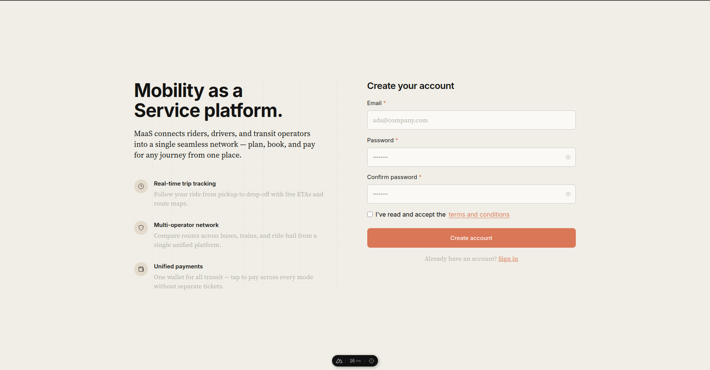
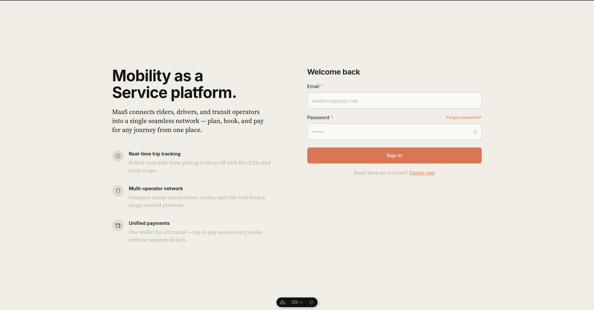
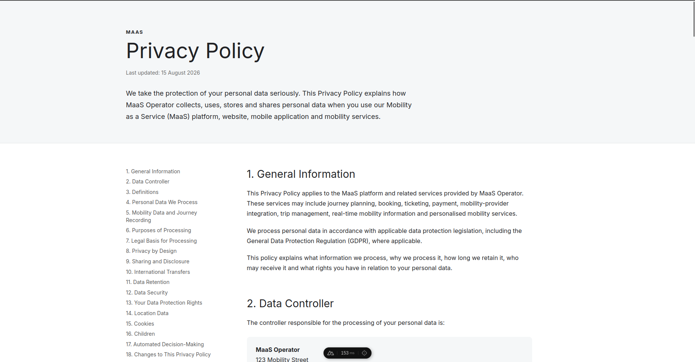
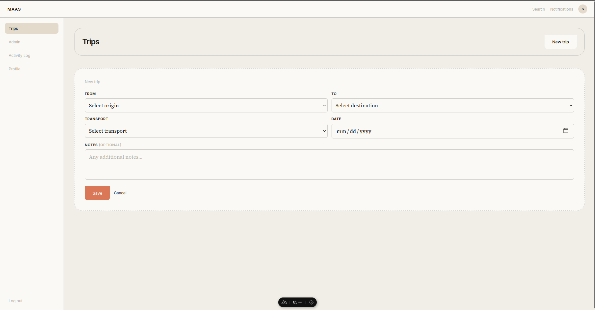
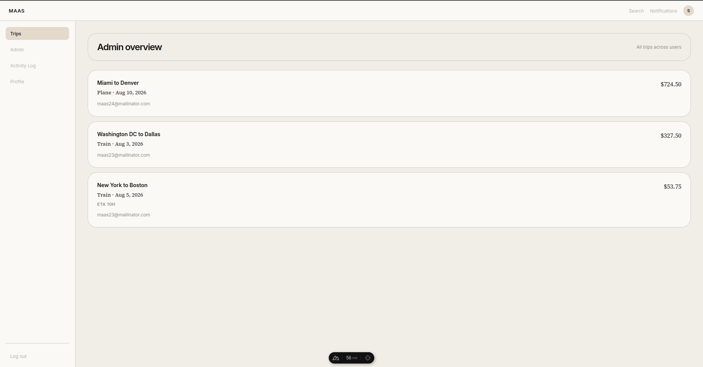
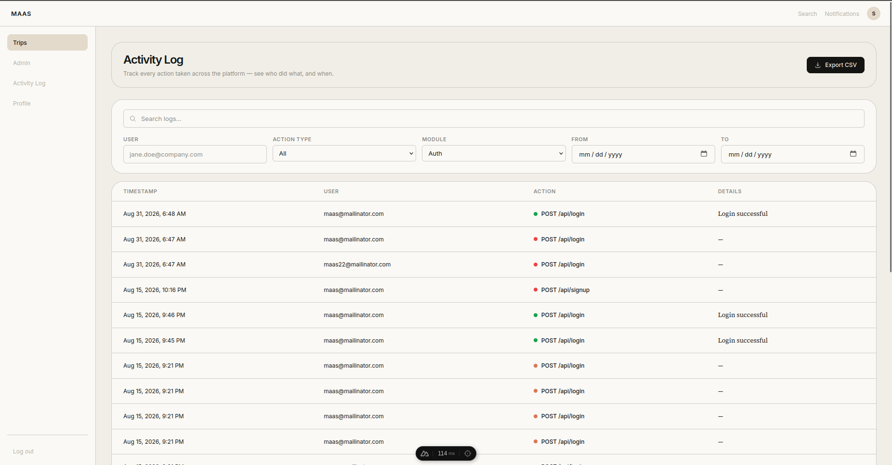

# MaaS — Mobility as a Service

A security-focused **Mobility as a Service** platform. This repository contains a
reference implementation that demonstrates how security controls are woven
throughout a MaaS application — from the user-facing client down to the Docker
network topology — and proves they block real attacks.

The project follows the security requirements laid out in the OWASP Secure Coding
Practices guide and the MaaS reference security architecture.

---

## Table of Contents

- [Prerequisites](#prerequisites)
- [Project layout](#project-layout)
- [Tech stack](#tech-stack)
- [Running the backend stack](#running-the-backend-stack)
- [Running the frontend client](#running-the-frontend-client)
- [Services](#services)
- [Stopping](#stopping)
- [Security](#security)
  - [Access control and authentication](#access-control-and-authentication)
  - [Authentication and password management](#authentication-and-password-management)
  - [Input validation and injection prevention](#input-validation-and-injection-prevention)
  - [Error handling and logging](#error-handling-and-logging)
  - [Network isolation — the DMZ](#network-isolation--the-dmz)
  - [Attack demonstration](#attack-demonstration)
- [Screenshots](#screenshots)

---

## Prerequisites

- [Docker](https://www.docker.com/) and Docker Compose installed
- [Node.js](https://nodejs.org/) (v18+ recommended)
- A clone of this repository on your machine

## Project layout

| Path | What it is |
|---|---|
| `maas-server/` | Backend: API + sensor ingestion (NestJS) |
| `maas-client/` | Frontend: web application (Nuxt) |
| `maas-services.yaml` | Docker Compose definition for the backend stack |
| `maas.txt` | The MaaS reference security architecture paper this project is based on |

## Tech stack

| Layer | Technology | Version | Notes |
|---|---|---|---|
| Frontend | [Nuxt 3](https://nuxt.com/) + Vue 3 | Nuxt `^3.21`, Vue `^3.5` | Web application (client) |
| Styling | [Tailwind CSS](https://tailwindcss.com/) | `^6.14` (`@nuxtjs/tailwindcss`) | Custom design-token theme (ivory/clay palette, serif + sans typography) |
| Backend | [NestJS](https://nestjs.com/) (Node.js) | `^11.0` (Node 20+) | Restructured as two services: `maas-server` (API) and ingestion |
| Relational data | [PostgreSQL](https://www.postgresql.org/) + [TypeORM](https://typeorm.io/) | PostgreSQL latest; TypeORM `^11.0`, `pg` `^8.22` | Users, payments |
| Document data | [MongoDB](https://www.mongodb.com/) + [Mongoose](https://mongoosejs.com/) | Mongodb Atlas local; Mongoose `^9.8` | Trips, sensor events, audit logs |
| Cache / broker | [Redis](https://redis.io/) + [BullMQ](https://bullmq.io/) | Redis `7` (alpine); Bull `^4.16`, `@nestjs/bull` `^11.0` | Rate limiting, brute-force tracking, background job queues |
| Email | Nodemailer (SMTP) | `^9.0` | Confirmation & password-reset flows |
| API docs | [Swagger](https://swagger.io/) | `@nestjs/swagger` `^11.4` | Auto-generated at `/docs` |
| Auth | JWT + bcrypt | `@nestjs/jwt` `^11.0`, bcrypt `^6.0` | Session tokens, password hashing |
| Validation | class-validator / class-transformer | `^0.15` / `^0.5` | Centralized DTO validation |
| Containerization | [Docker](https://www.docker.com/) + Docker Compose | — | DMZ / internal network isolation |

## Running the backend stack

### 1. Configure the server environment

Copy the example environment file into `maas-server/` and edit it as needed:

```bash
cp maas-server/.env.example maas-server/.env
```

> The `.env` file **must** be placed in the `maas-server/` folder, **not** the
> repository root.

### 2. Start the stack

From the repository root, start all databases, caches, and backend services:

```bash
docker compose -f maas-services.yaml up --build
```

That's it — this one command boots the full backend: the API, the sensor ingestion
service, and their supporting PostgreSQL, MongoDB, and Redis.

## Running the frontend client

The client is **separate** from the backend stack and runs on its own.

### 1. Configure the client environment

```bash
cp maas-client/.env.example maas-client/.env
```

Then set the API base URL (the MaaS API exposed by the backend stack):

```
NUXT_PUBLIC_BASE_URL=http://localhost:4081
```

### 2. Install dependencies

```bash
cd maas-client
npm install
```

### 3. Start the client

For development (with hot reload):

```bash
npm run dev
```

For a production build:

```bash
npm run build
npm run preview
```

The client runs at **http://localhost:3020** in development.

## Services

| Service | URL / Port |
|---|---|
| MaaS client (dev) | http://localhost:3020 |
| MaaS API | http://localhost:4081 |
| Sensor ingestion | http://localhost:3001 |
| Swagger docs | http://localhost:4081/docs |

## Stopping

Stop the backend stack:

```bash
docker compose -f maas-services.yaml down
```

Stop the client with `Ctrl+C` in its terminal.

---

## Security

The platform was built security-first. Instead of a single security component,
controls are distributed throughout the code and infrastructure, each one mapped to
a specific point in the OWASP Secure Coding Practices guide.

### Access control and authentication

*Reference: OWASP SCP Points 23, 24, 58, 59.*

The plain login was replaced with a real authentication system using **JWT**.
Every protected page or function requires a valid username and password, and a
session token (JWT) is only issued after a correct login. On every subsequent
request, the application verifies this token to confirm the caller's identity.
Admin actions additionally require an admin role.

**Where it lives:**
- JWT verification — `maas-server/libs/shared/src/guards/jwt.guard.ts`
- Role enforcement on admin routes — `maas-server/apps/maas-server/src/admin.controller.ts`
- Guard applied to trip routes — `maas-server/apps/maas-server/src/trip.controller.ts`

### Authentication and password management

*Reference: OWASP SCP Points 30, 38, 39, 41.*

- **Password storage** — passwords are never stored in plain text. They are hashed
  with a one-way algorithm, so they remain unreadable even if the database is
  compromised.
- **Password policy** — a minimum length (and complexity) is enforced to make
  passwords harder to guess.
- **Brute-force protection** — Redis tracks the number of failed login attempts
  from the same IP. After a set number of failures, further attempts are
  temporarily blocked, stopping automated guessing attacks.

The super admin account can be seeded on startup by setting `SEED_SUPER_ADMIN=true`
in `maas-server/.env`.

**Where it lives:**
- Brute-force lockout — `maas-server/apps/maas-server/src/brute-force.service.ts`
- Password hashing (`bcrypt`) — `maas-server/apps/maas-server/src/app.service.ts`
- Registration / login validation — `maas-server/apps/maas-server/src/dto/create-user.dto.ts`

### Input validation and injection prevention

*Reference: OWASP SCP Points 1, 6, 14, 21, 167.*

Every endpoint in both the API and the ingestion service validates incoming data
centrally before it is processed. The system checks data type (accepting a number
and rejecting text), length, and format, and only allows a list of safe characters.
This prevents attackers from injecting malicious code — such as SQL or scripts —
through input fields, forms, or API calls.

**Where it lives:**
- Global validation pipe — `maas-server/apps/maas-server/src/main.ts` and `maas-server/apps/injestion/src/main.ts`
- Request DTOs with `class-validator` — `maas-server/apps/maas-server/src/dto/*.ts` and `maas-server/apps/injestion/src/dto/*.ts`

### Error handling and logging

*Reference: OWASP SCP Points 107, 109, 121, 122, 124.*

- **Comprehensive logging** — a detailed audit trail records every important action:
  who logged in or failed to, who tried to access data they shouldn't, which input
  was rejected, and what the request contained.
- **Safe errors** — errors never reveal internal technical details such as system
  paths or stack traces. Users see a generic, friendly message, preventing attackers
  from learning about the system's internals.

**Where it lives:**
- Audit log interceptor — `maas-server/apps/maas-server/src/audit-log.interceptor.ts`
- Admin log retrieval / export — `maas-server/apps/maas-server/src/admin.service.ts`

### Network isolation — the DMZ

*Reference: OWASP SCP Point 165 (Principle of Least Privilege via network).*

To protect the rest of the system, the platform is structured around a
**Demilitarized Zone (DMZ)**. The Docker Compose configuration defines two separate
networks:

| Network | Purpose | Services |
|---|---|---|
| `maas-dmz` | Public-facing zone | `maas-server`, ingestion |
| `maas-internal` | Isolated zone (no exposed ports) | PostgreSQL, MongoDB, Redis, admin tooling |

The public-facing services — the API and the sensor ingestion service — sit in the
`maas-dmz` network. The sensitive databases (PostgreSQL, MongoDB) and the cache
(Redis) sit in `maas-internal`, which exposes **no ports** to the host or the
internet.

The public services connect to both networks, so they can securely reach the
databases internally while nothing sensitive is directly reachable from outside.
This containment means that even if an attacker compromises a public-facing server,
they cannot reach the databases directly from the internet.

**Where it lives:**
- Network topology — `maas-services.yaml` (root of the repository)

### Attack demonstration

To prove the security layer works, these attacks were simulated and successfully
blocked:

1. **Unauthenticated request** — an attacker tried to access a protected endpoint
   without a valid JWT session token. The system detected the missing token,
   rejected the request with an error, and logged the attempt.
2. **Malformed input / injection** — an attacker submitted a malicious payload in an
   input field designed to confuse the database. The centralized input validation
   rejected the illegal characters and logged the event.
3. **Expired or reused JWT** — an attacker tried to use an old, expired session
   token. The authentication logic detected it was no longer valid, rejected the
   request, and logged the attempt.

---

## Screenshots

### Sign Up page
New users create an account here with an email and a password. The form enforces
the password policy (minimum length) before an account can be created.



### Login page
Registered users sign in to receive a session token (JWT). Failed attempts are
counted and block further tries once the brute-force threshold is reached.



### Privacy Policy
The platform makes terms and privacy policies visible to users, giving them
control over their information as required by the reference architecture.



### Creating a Trip
Users plan a journey by specifying its origin, destination, and transport mode.
This metadata is validated before it is stored.



### Admin — Viewing Trips
Administrators can list all planned journeys in the system, a capability that
requires an admin role on top of the regular session token.



### Admin — Viewing Activities
The audit log records every important action. Administrators can review and export
these activities to keep the system accountable.


